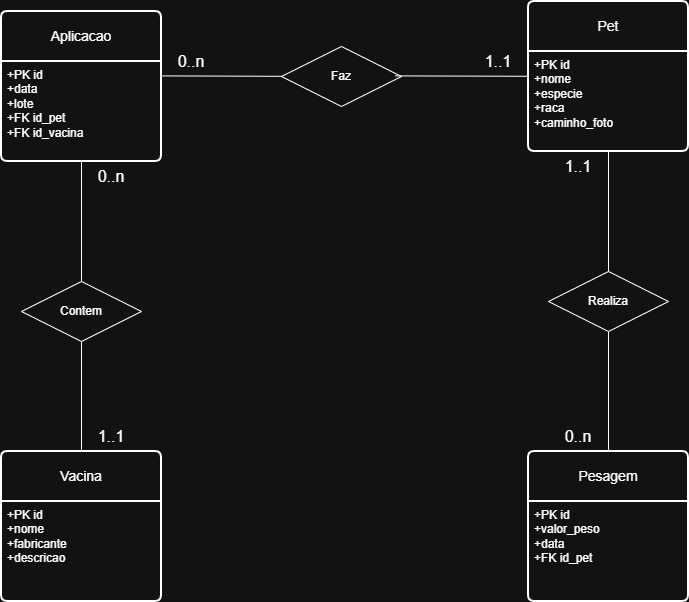

# Modelagem de Dados - Saúde Pet

Este documento detalha a estrutura de dados planejada para a v2.0 do projeto, focando na transição para Orientação a Objetos e Banco de Dados Relacional.

## Diagrama de Entidade e Relacionamento (DER)

## Dicionário de Dados (Resumo)

### Entidades Principais:
- **Pet:** Armazena os dados de identidade do animal.
- **Pesagem:** Registro do histórico de peso vinculados a um Pet.
- **Vacina:** Catálogo com os tipos de vacinas disponíveis.
- **Aplicação:** Registro da aplicação da vacina em um pet.

## Regras de Negócio e Cardinalidades:
- **Pet (1,1) --- (0,n) Pesagem:** Um pet pode ter vários registros de peso.
- **Pet (1,1) --- (0,n) Aplicação:** Um pet pode receber várias doses de vacinas.
- **Vacina (1,1) --- (0,n) Aplicação:** Uma mesma vacina do catálogo pode ser aplicada em vários pets.